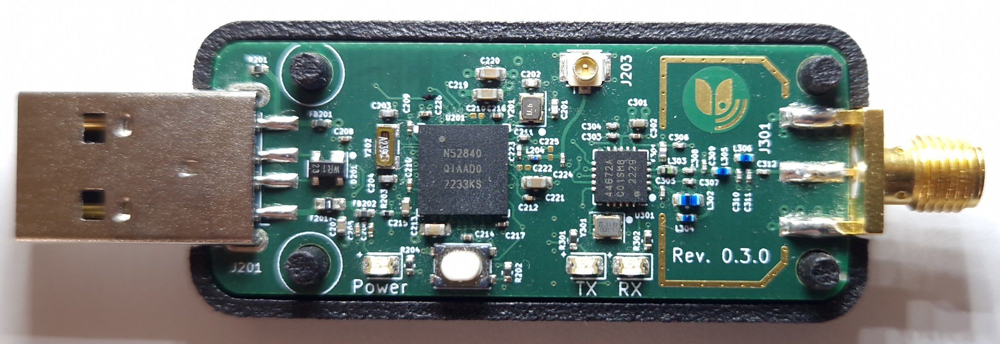

..
   SPDX-FileCopyrightText: Copyright (c) 2023 GARDENA GmbH
   SPDX-License-Identifier: GPL-3.0-or-later
   dongle_nrf52840:

.. _dongle_nrf52840:

GARDENA Si4467 Dongle
#####################

Overview
********

The Si4467 Dongle is a USB dongle carrying an nRF52840 and a sub-GHz transceiver, matched for
863 to 876 MHz. In this repository it runs the Wi-SUN sniffer firmware; the hardware itself is
protocol agnostic and has also been used as a plain radio node and as a network interface.

Hardware
********

The ``dongle_nrf52840`` consists of an nRF52840 accompanied by an Si4467.

The nRF52840 has two external oscillators. The frequency of
the slow clock is 32.768 kHz. The frequency of the main clock
is 32 MHz.

The Si4467 has a 26 MHz oscillator.

Test Points
===========

Rev. 0.1.0
----------

+------------+------------------+
| Test Point | Signal           |
+============+==================+
| TP101      | P1.04 / SDN      |
+------------+------------------+
| TP102      | P0.04 / SPI SCLK |
+------------+------------------+
| TP103      | P0.06 / SPI MOSI |
+------------+------------------+
| TP104      | P0.08 / SPI MISO |
+------------+------------------+
| TP105      | P0.13 / SPI NSEL |
+------------+------------------+
| TP106      | P1.09 / NIRQ     |
+------------+------------------+
| TP201      | VBUS_nRF         |
+------------+------------------+
| TP202      | VDD              |
+------------+------------------+
| TP203      | VBUS             |
+------------+------------------+

Rev. 0.2.0
----------

Rev. 0.2.0 provides the following test points in addition to the test points of Rev. 0.1.0:

+------------+------------------+
| Test Point | Signal           |
+============+==================+
| TP204      | P0.02            |
+------------+------------------+
| TP205      | P0.29            |
+------------+------------------+
| TP206      | P0.31            |
+------------+------------------+
| TP207      | SWDCLK           |
+------------+------------------+
